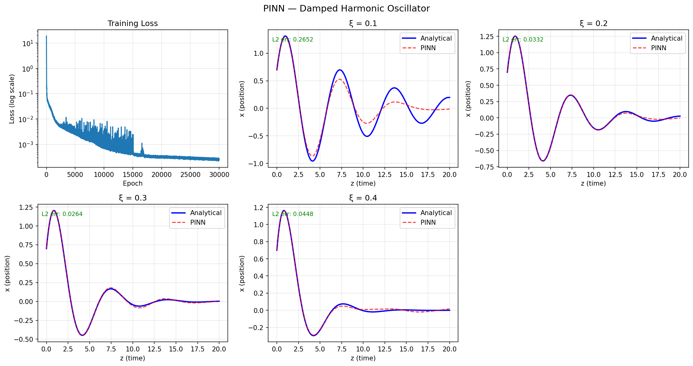

# PINN — Damped Harmonic Oscillator
### GSoC 2026 ML4SCI | GENIE/PINNDE Evaluation Task

A Physics-Informed Neural Network (PINN) that solves the damped harmonic oscillator ODE without any training data — using only the physics equation itself as the loss function.

---

## The Problem

$$\frac{d^2x}{dz^2} + 2\xi\frac{dx}{dz} + x = 0$$

| Parameter | Value |
|-----------|-------|
| Initial position x(0) | 0.7 |
| Initial velocity x'(0) | 1.2 |
| Damping range ξ | [0.1, 0.4] |
| Time domain z | [0, 20] |

---

## What is a PINN?

A standard neural network learns from labeled data. A PINN learns from **physics**. Instead of minimizing prediction error against a dataset, the loss function directly penalizes violations of the governing differential equation:

```
Total Loss = Physics Loss + Initial Condition Loss

Physics Loss     = mean( x'' + 2ξx' + x )²    ← ODE residual at random points
IC Loss          = (x(0) - 0.7)² + (x'(0) - 1.2)²
```

Derivatives `x'` and `x''` are computed exactly using PyTorch autograd — no finite differences, no approximations.

---

## Results

| ξ | L2 Relative Error |
|---|-------------------|
| 0.1 | 26.5% |
| 0.2 | 3.3% |
| 0.3 | 2.6% |
| 0.4 | 4.5% |

The ξ=0.1 case (least damping, most oscillations) is hardest due to **spectral bias** — neural networks naturally learn low-frequency patterns first and struggle with rapid oscillations over a long time domain.



---

## File Structure

```
PINN-Damped-Oscillator/
├── pinn_oscillator.py     # model architecture, training, evaluation
├── outputs/
│   ├── pinn_results.png   # comparison plots vs analytical solution
│   └── pinn_oscillator.pth  # saved model weights
├── requirements.txt
└── README.md
```

---

## Setup

```bash
python3 -m venv pinn_env
source pinn_env/bin/activate
pip install -r requirements.txt
python3 pinn_oscillator.py
```

---

## Requirements

```
torch
numpy
matplotlib
```

---

## Architecture

- **Input:** (z, ξ) — time and damping ratio
- **Output:** x(z, ξ) — predicted position
- **Layers:** 6 hidden layers, 128 units each, tanh activation
- **Why tanh:** ReLU has zero second derivative everywhere — autograd can't compute x'' through it. tanh is smooth and infinitely differentiable.
- **Training:** 30,000 epochs, Adam optimizer (lr=5e-4), 3,000 collocation points per epoch

---

## Connection to PINNDE Project

This evaluation task directly demonstrates the core mechanism behind the GENIE PINNDE project. The reverse-time diffusion equation used in particle shower generation is a high-dimensional PDE — the same PINN approach (physics residual as loss + autograd derivatives) scales to that setting. This oscillator serves as a 1D proof-of-concept for the full pipeline.

---

## Author
Binoy Saha | [github.com/binoysaha025](https://github.com/binoysaha025) | binoysaha025@gmail.com
